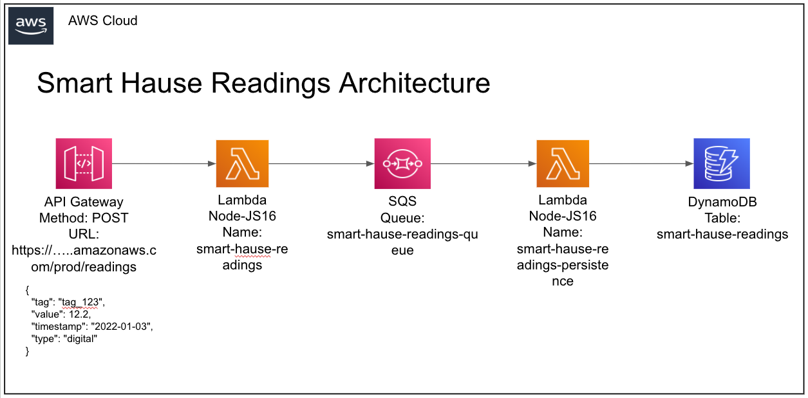

# Monorepo SmartHause PoC

This is an PoC(Proof of Concept) project using the following technologies:
 - **Typescript**
 - **NodeJS 18**
 - **Turborepo** to manage our monorepo
 - **Jest** as our default test libray
 - **Terraform** to manage the IaC
 - **Github Actions** as our CI/CD
 - **AWS** as our Cloud Services Provider

## Main Architecture



## Folder Structure

- `lambdas`: store all the lambda functions
- `iac`: store all the IaC files
- `packages/readings-commons`: basic shared classes and interfaces thourgh the apps
- `packages/eslint-config-custom`: `eslint` configurations for node projects
- `packages/tsconfig`: `tsconfig.json`s used throughout the monorepo
- `packages/jest-config`: `jest-config.json`s used throughout the monorepo

## Test

To build all lambdas and packages, run the following command:

```
npm test
```
## Build

To build all lambdas and packages, run the following command:

```
npm run build
```
